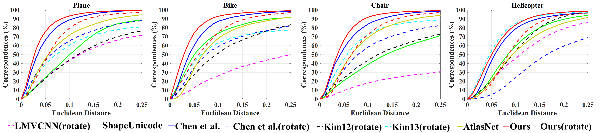

### Evaluation

For semantic correspondence evaluation on BHCP, please run evaluateBHCP.py

We generate all pairs of shapes for testing, e.g., 9,900 pairs for chair (100 samples). We also provide the results for the following figure

We acknowledge Nenglun Chen for sharing the results of baselines. Please kindly consider to cite their paper when you use the results. 

#### 

